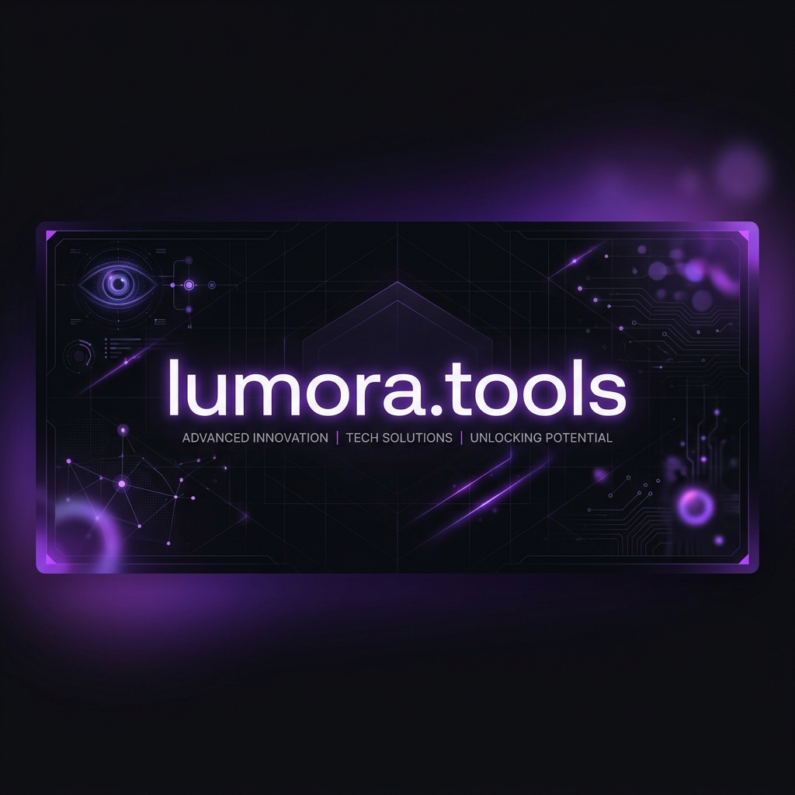

<div align="center">

</div>

# 🧶 Lumora Tools

> **A curated playground of minimal, premium, local-first web utilities.**  
> Built with React, Tailwind CSS, and Framer Motion. Engineered for speed, privacy, and seamless user experience.

---

## ✨ Why Lumora Tools?

- 🔒 **Local-First & Private:** All data processing (image compression, PDF generation, JSON formatting) happens entirely inside your browser. Your files never touch a server.
- 🎨 **Premium Aesthetics:** Sleek dark-mode native design with fluid animations and responsive layouts built for creative professionals and developers.
- ⚡ **Zero Bloat:** Minimal friction, instant startup times, and utility-focused features that solve everyday developer and designer tasks.

---

## 🛠 Features & Included Tools

### 🎨 Design & Visuals
* **Vector Lab Gradients:** Create, preview, and copy high-fidelity modern css gradients.
* **Chromatic Extractor:** Extract gorgeous color palettes from any uploaded image instantly.
* **Workout Canvas:** A modular planning and visual board to design and track workouts.

### 📝 Content & Document Synthesis
* **Lumora PDF Studio:** Synthesize clean, high-fidelity PDFs from structured templates (Resumes, Invoices, Notes).
* **Ether Markdown:** A beautiful, distraction-free markdown environment with live GitHub-flavored preview.
* **PDF Merger & Converter:** Merge multiple PDFs or convert images to/from PDF formats locally.

### 🔧 Developer Utilities
* **Structure JSON:** Parse, validate, minify, and explore JSON data tree structures.
* **Global Size Converter:** Convert between different design/CSS units (px, rem, em, % etc.) seamlessly.
* **Format Converters:** Convert HEIC, PNG, JPG, ICO, and compress images with complete visual quality control.

---

## 🚀 Running Locally

Ensure you have **Node.js** installed on your system.

### 1. Clone & Install Dependencies
```bash
git clone https://github.com/roparkinfiniq/lumora.tools.git
cd lumora.tools
npm install
```

### 2. Configure Environment Variables
Copy `.env.example` to `.env.local` and configure your keys if needed:
```bash
# Set your Gemini API key for AI features (optional)
GEMINI_API_KEY="your_api_key_here"
```

### 3. Start Development Server
```bash
npm run dev
```
Open **[http://localhost:3000](http://localhost:3000)** in your browser.

---

## 📦 Tech Stack

- **Framework:** React 19 (TypeScript)
- **Bundler:** Vite 6
- **Styling:** Tailwind CSS v4
- **Animations:** Motion (Framer Motion v12)
- **Icons:** Lucide React

---

*Made with 🤍 by [Raone Park](https://lumora-lab.tistory.com/).*
